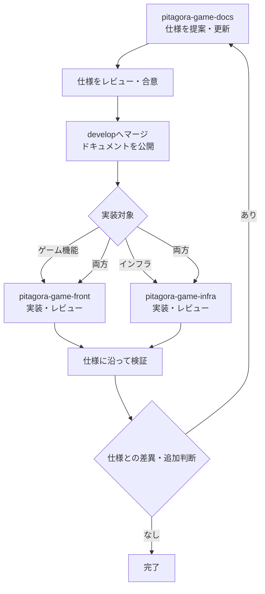

# 開発フロー

このページでは、仕様書を管理する `pitagora-game-docs`、インフラを管理する `pitagora-game-infra`、ゲーム機能を実装する `pitagora-game-front` の間で、仕様の変更から実装・公開までを進める方法を定めます。

## リポジトリの役割

| リポジトリ | 役割 |
| --- | --- |
| `pitagora-game-docs` | 仕様、合意事項、開発・運用手順を記録する |
| `pitagora-game-infra` | 実行環境、デプロイ、インフラ運用に関する実装を管理する |
| `pitagora-game-front` | ゲーム画面、操作、ステージなどのフロントエンド実装を管理する |

仕様の決定内容はドキュメントに記録し、実装側はその内容を参照します。仕様変更を伴う場合は、実装とドキュメントの差が残らないよう両方を更新します。

## 通常の進め方

1. **仕様を提案する:** `pitagora-game-docs` の該当ページを更新し、目的、画面・状態、操作、期待結果、未確定事項を記載します。
2. **仕様をレビューする:** 影響するステージ、画面、共通仕様を確認し、必要に応じて `pitagora-game-front` と `pitagora-game-infra` の担当者をレビューに含めます。
3. **仕様変更をマージする:** このリポジトリでは `develop` を対象にプルリクエストを作成します。合意後にマージすると、GitHub Actions がドキュメントをビルドし、生成物を `develop` ブランチの `docs/` にコミットします。
4. **実装タスクを作成する:** 機能変更は `pitagora-game-front`、インフラ変更は `pitagora-game-infra` にタスクを作成します。両方に影響する場合は、依存関係と実施順をそれぞれのタスクに記載します。
5. **実装・検証する:** 各リポジトリで変更をレビューし、該当する仕様に沿って動作を確認します。仕様との差異や新しい判断が生じた場合は、ドキュメントへ反映します。

## 仕様変更のプルリクエスト

仕様変更のプルリクエストには、変更理由、対象ページ、影響する画面・ステージ、実装側に必要な対応を記載します。動作やルールの変更では、変更前後の違いと既存データ・進行への影響も説明します。

未決定事項は決定済みの仕様と分けて記載し、担当者または決定方法が分かる場合は併記します。仕様に関係する実装タスクがある場合は、関連 issue やプルリクエストへのリンクを追加します。

## リポジトリ間の自動連携

- このリポジトリの `develop` への push で Zensical をビルドし、生成物を `develop/docs` にコミットします。
- `main` を対象とするプルリクエストがマージされると、GitHub Actions が変更ファイルごとに issue を作成します。
- `content/` の変更は `pitagora-game-front`、Actions・ビルド設定（`.github/`、`requirements.txt`、`zensical.toml`）の変更は `pitagora-game-infra` が対象です。生成物 `docs/` の変更は除外します。
- issue には変更ファイルと元のプルリクエストを記載します。対象外のファイルに必要な実装タスクがある場合は、担当者が手動で補います。
- issue 作成には、両リポジトリへの書き込み権限を持つ `CROSS_REPO_ISSUES_TOKEN` が Actions secret に設定されている必要があります。

この自動 issue 作成は `main` 向けプルリクエストのマージ時に動作します。通常の仕様レビュー・公開先として定めた `develop` 向けフローとは分けて扱います。

## 完了条件

- 仕様変更が合意され、ドキュメントに反映されている。
- 影響する実装タスクの担当リポジトリと関連リンクが明確である。
- 実装が仕様に沿って検証され、仕様との差があれば解消または記録されている。
- 仕様変更に伴う画面遷移、共通仕様、ステージ進行への影響が確認されている。
